## Current partners

1. Capital Workforce Partners
2. Capitol Region Council of Governments
3. Hartford Foundation for Public Giving
4. Hispanic Health Council
4. MetroHartford Alliance
6. Opportunities Hartford (City of Hartford)
7. Trinity Center for Urban and Global Studies
8. Urban League of Greater Hartford
9. United Way of Central and Northeastern Connecticut

--- &twocol
## Defining the region

CRCOG region as a basis - Hartford + 29 surrounding towns. 

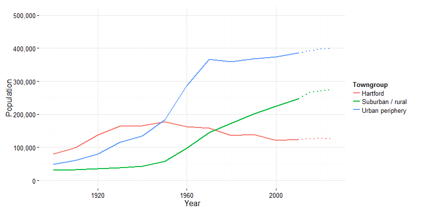 

--- &radio

## Population growth ##

What has been the population change in West Hartford since 1970?

1. _-7%_
2. 7%
3. 14%
4. 28%

*** .hint

In 1970, the population of West Hartford was 68,031. 

*** .explanation

It has gone from 68K to 63K. The projected population through 2025 is just under 63K.  

---
## Low population growth
 
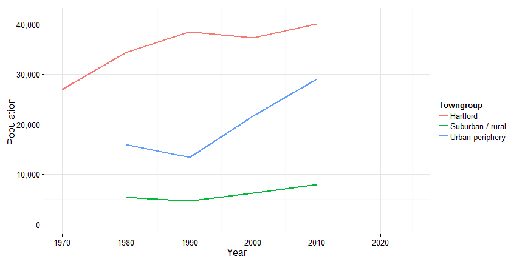 

--- &radio

## Poverty ##

Fewer people lived in poverty in Hartford in 2000 than in 1990. Is this good news or bad news? Explain your answer. 

1. Good news
2. _Bad news_

*** .hint

37,000 people lived in poverty in Hartford by 2000. 

*** .explanation

During this period, population loss was faster than the increase in poverty. Poverty thus became more concentrated in the city during this decade - many people left the city, some of them poor. The current poverty rate for the city is 38 percent, among the highest in the country. 

--- 
## Suburbanization of poverty

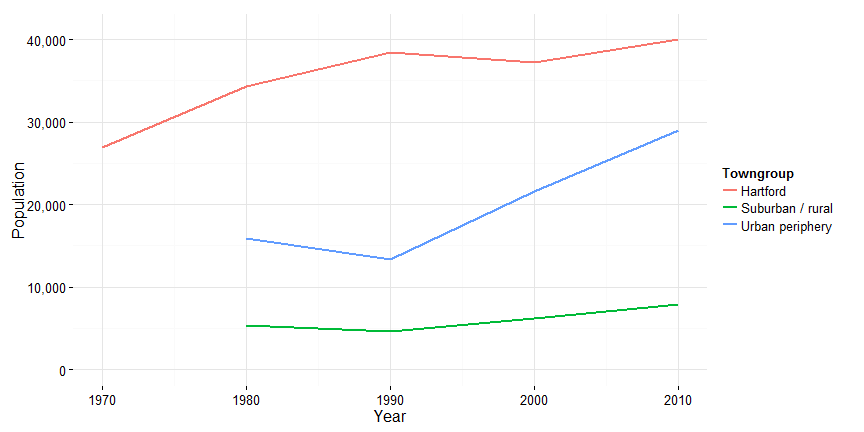 

---
## Aging population

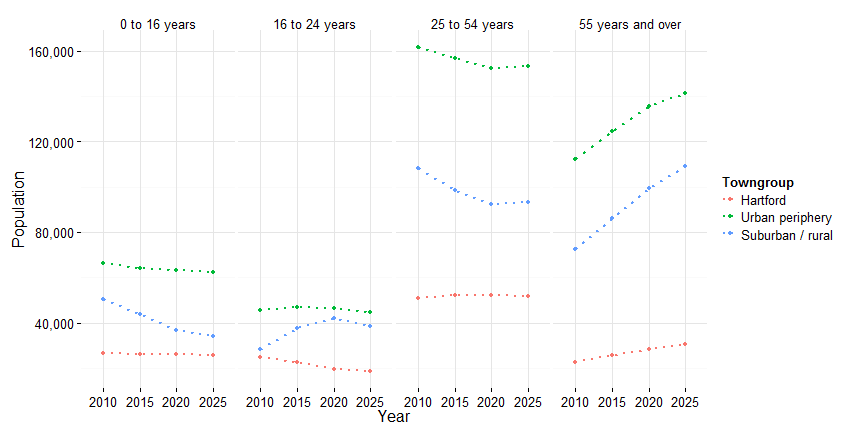 

--- &radio

## School enrollment ##

What proportion of area students go to school outside their 'home' district?

1. 1 in 20
2. 1 in 10
3. _1 in 6_
4. 1 in 5
5. 1 in 4

*** .hint

This includes charter schools, magnet schools, private and parochial schools, home-schooling, vocational schools, etc. 

*** .explanation

16% (or 1 in 6) of students in the region attend school outside their home district, either through magnets, charters, open choice, private schools or other alternatives. However, there is substantial variation across towns and by grade level, with almost half of students leaving the home district in Bloomfied by high school.   

--- 
## School enrollment declining overall

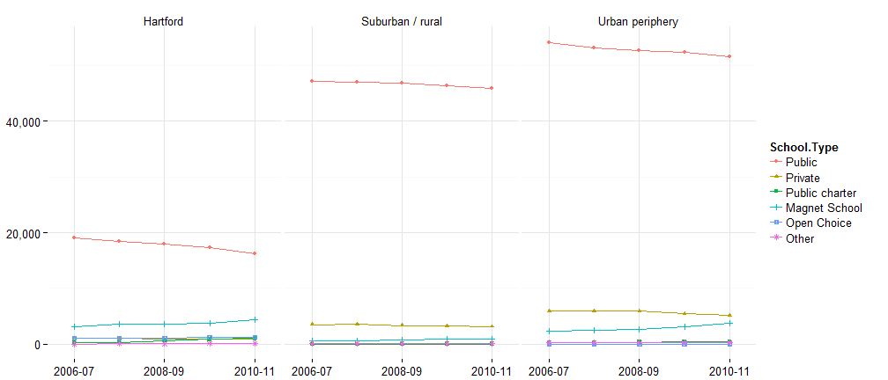 

--- &radio

## Linguistic diversity ##

Which school district has the most languages spoken by its students?

1. East Hartford
2. Hartford
3. Rocky Hill
4. _West Hartford_
5. Wethersfield

*** .hint

46 languages are spoken in this district (according to 2010-11 SDE data), although other sources report [higher figures](http://www.hellowesthartford.org). 

*** .explanation

West Hartford has the most languages, followed by Hartford. Hartford has the highest percentage of ELL students though, followed by East Hartford.  

--- 
## A diverse population

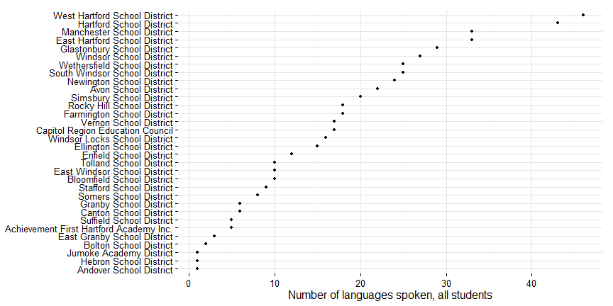 

--- &radio

## Globally connected region ##

Which of the following is _not_ among the top 5 languages spoken in Hartford Public Schools?

1. Albanian
2. _Creole-Haitian_
3. Karen
4. Portuguese
5. Serbo-Croatian

*** .hint

Spanish is the most frequently spoken language. 

*** .explanation

The top languages in HPS as of 2010-11 (per SDE) are: Spanish, Serbo-Croatian (Bosnian), Karen, Albanian, Portuguese and Somali (for all students and ELL students).  Many of these languages closely track recent refugee arrivals.

--- 
## Refugee arrivals by country of origin

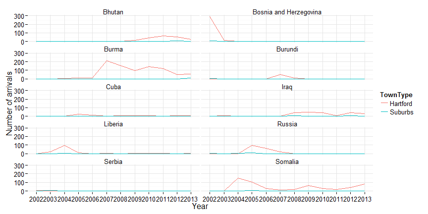 

--- &radio

## Workforce skills ##

Connecticut is forecasted to need what percent middle-skills workers by 2020?

1. 18%
2. _28%_
3. 38%
4. 48%

*** .hint

30% of jobs are forecasted to be low-skills jobs. 

*** .explanation

The Center for Education and the Workforce at Georgetown forecasts CT jobs to requires 30% low skills (no college), 28% middle skills (some college or credential) and 42% high skills (college or higher). Job growth is forecasted to occur by roughly the same percentages. 

--- 
## Meeting demands for a skilled workforce

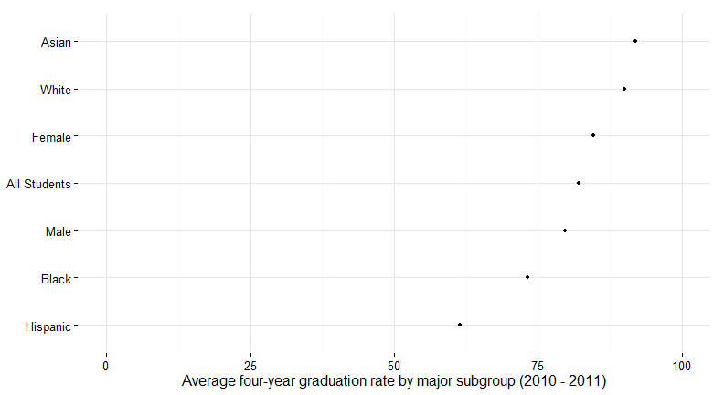 

--- 
## Talent pipeline from schools

 

--- &radio

## Jobs ##

How many people commute into Hartford from other towns for work?

1. 46,000
2. 66,000
3. 86,000
4. _106,000_
5. 156,000

*** .hint

Hartford has (roughly) 121,000 jobs within city limits.   

*** .explanation

106,000 workers commute into Hartford from the region outside (most from 'Greater Hartford'). 15,000 Hartford residents work in Hartford; 28,000 Hartford residents are employed outside Hartford.

--- 
## Everyone commutes, mostly to Hartford

--- &radio

## Jobs ##

Which sector had the fastest job growth in the last 10 years in Greater Hartford?

1. Construction
2. Finance and Insurance
3. _Healthcare & Social Assistance_
4. Manufacturing
5. Retail Trade

*** .hint

Only one of these sectors had positive job growth in the last 10 years. 

*** .explanation

Healthcare and social assistance was the fastest growing; finance and insurance, manufacturing and construction were the three slowest growing sectors over the same period. 

--- 
## What kind of jobs are there?

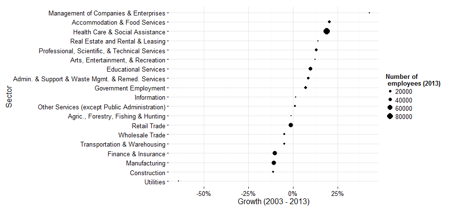 

--- &radio

## 3rd grade reading ##

What percent of ELL students in the region were at or above goal for 3rd grade reading (from 2005 - 2011)?

1. 5%
2. _9%_
3. 14%
4. 25%
5. 34%

*** .hint

65% of non-ELL students were at or above goal.  

*** .explanation

8.96% of ELL students were at or above goal on 3rd grade reading tests for the period 2006 - 2011 for all districts in the region. 

--- 
## 3rd grade reading as a milestone

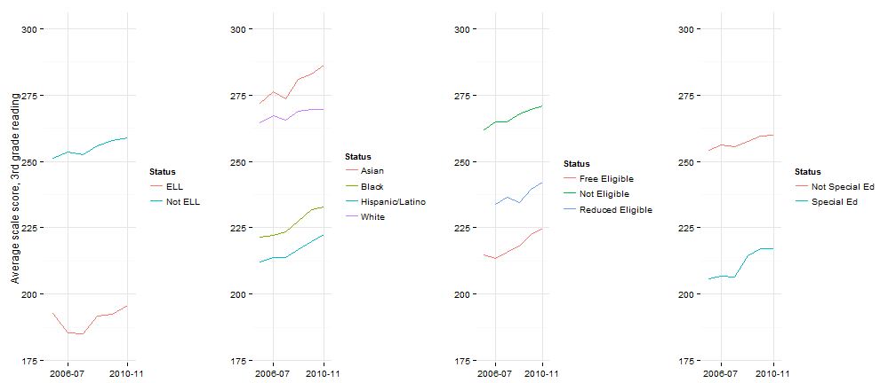 

--- &radio

## Chronic absenteeism ##

Which one of the following districts had a chronic absenteeism rate over 10% in 2012?

1. Bloomfield
2. East Hartford
3. _Somers_
4. West Hartford
5. Windsor Locks

*** .hint

Chronic absenteeism is the percent of students missing over 10% of days during the school year. The average for the region is about 8 percent.  

*** .explanation

Somers had a rate of 14.3% for 2012. 

--- 
## Chronic absenteeism another early warning sign

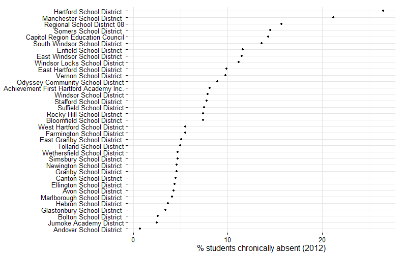 

--- &radio

## Home ownership ##

Which neighborhood has the highest homeownership rate (owner-occupied housing) in Hartford?

1. Behind the Rocks
2. Blue Hills
3. _Southwest_
4. West End

*** .hint

About 65% of units are owner-occupied in this neighborhood; Blue Hills is also high relative to the city average. 

*** .explanation

Southwest has the highest home ownership rate in the city, followed by Blue Hills. These are the only two neighborhoods in which a majority of housing units are owner-occupied.

--- 
## Home ownership sign of civic health

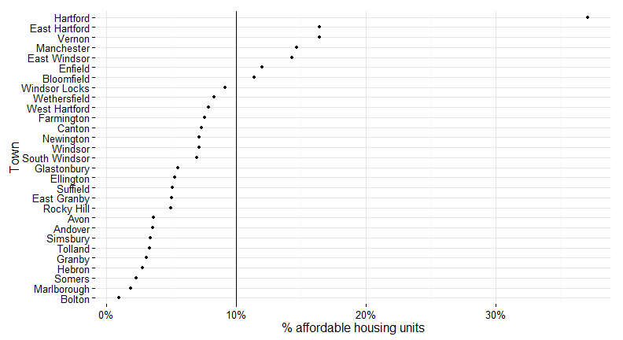 

--- 
## Affordable housing stock in the region

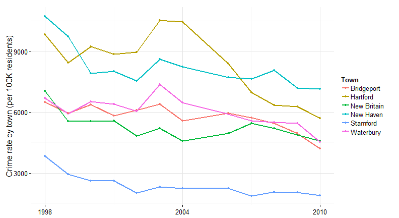 

--- &radio

## Crime rates ##

Which Connecticut city has the highest crime rates (all crime)?

1. Bridgeport
2. Hartford
3. New Britain
4. _New Haven_
5. Stamford
6. Waterbury

*** .hint

It's not Stamford.

*** .explanation

Crime rates have been dropping nationally and have dropped in Hartford in recent years. However, most of the recent decline has been a drop in property crime and violent crime rates have not declined in recent years.

--- 
## Hartford getting safer

 

--- &radio

## Voter turnout ##

What percent of registered voters turned out for the 2012 presidential election?

1. 57%
2. 67%
3. _77%_
4. 87%
5. 97%

*** .hint

Towns with below average turnout were: East Hartford, East Windsor, Enfield, Hartford, Newington and Stafford.  

*** .explanation

77% of registered voters turned out for the 2012 presidential election. 

--- 
## Voter turnout another measure of civic health

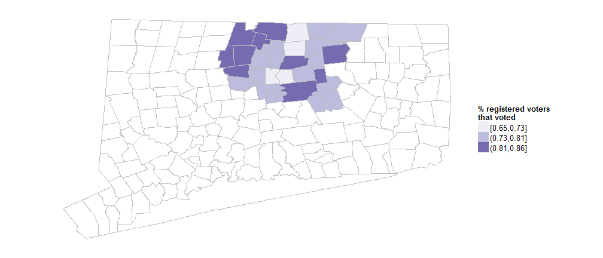 

